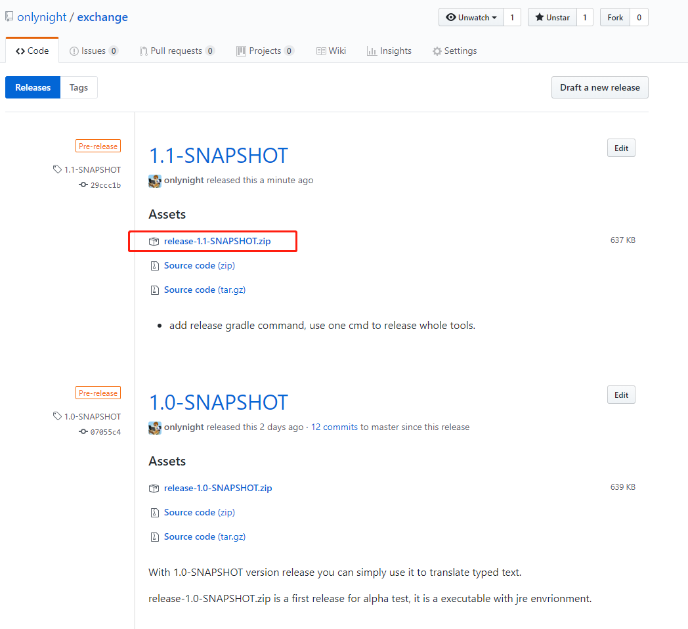
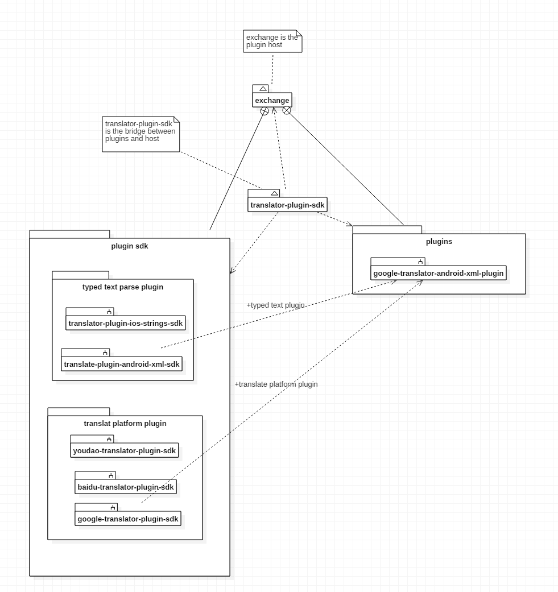

由Java编写基于插件形式的格式化文本翻译工具
=======================================

**项目地址：https://github.com/onlynight/exchange**

一年多以前写过一个翻译工具，支持google、baidu、youdao翻译，并且可拓展，但是拓展性不是很好，
项目地址：https://github.com/onlynight/Translator

这个新的项目是基于插件形式编写的，你可以任意组合翻译平台和格式化文本解析插件来达到翻译的嘴角效果。
目前相关官方已添加google，百度，有道翻译平台插件；并且集成android ***strings.xml*** 以及 ios 
***Localizable.strings*** 格式化文本解析插件，帮助你快速实现应用国际化。

```text
如果国际化要求较高，项目中有大量的文本需要国际化，你可以先使工具翻译文本，然后再人工校对，同样会增加翻译效率。
```

## 使用

#### 1. 下载 release 包

你需要去项目的releases中去下载最新的发布包：https://github.com/onlynight/exchange/releases

下载 ```release-<version>.zip``` 压缩包。



#### 2. 配置 ```translate_config.ini``` 文件

```ini
[platform key]
# baidu translate api info, you should replace it with your own.
# the doc is here: http://api.fanyi.baidu.com/api/trans/product/apidoc
;appId = 123412341
;appKey = asdfasqre14as11423412
;apiUrl = https://api.fanyi.baidu.com/api/trans/vip/translate
;others =

# google translate api info, you should replace it with your own.
# doc is here: https://cloud.google.com/translate/v2/quickstart
appId =
appKey = 1234123aewrqwf32412qwerqwerq124312234
apiUrl = https://translation.googleapis.com/language/translate/v2
others =

# youdao translate api info, you should replace it with your own.
# the doc is here: http://ai.youdao.com/docs/doc-trans-api.s#p02
; appId = 1234542212341
; appKey = asdftrrsaqwerfgasTQE1234RTEWQtw
; apiUrl = http://openapi.youdao.com/api
; others =

[platform]
# now support google, baidu, youdao translate platform api.
# the value you can choose are "google", "baidu", "youdao"
translatePlatform = google

[text type]
# now support android .xml string res and ios .strings string res translate.
# the value you can choose are "android" or "ios"
textType = android

[translator]
# the source language you provided.
sourceLanguage = zh-CN

# if you want translate all language you should use "all" to replace this value.
# use "all" means you want translate the platform support all languages;
# or you should use language code to tell the translate you want to translate.
#
# the platform support language contains in the root of the project support_laguage.txt
# you can check this file to get the platform support language
# eg1: destinationLanguage = en
# eg2: destinationLanguage = en,zh-TW
# eg3: destinationLanguage = all
destinationLanguage = en

# the translate file must in the same path or sub dir of the translator.jar.
# this value assign the folder name, if you don't want use sub dir,
# just use "/" to replace the value
sourceFilePath = values
```

- ```[platform key]``` 这组参数是翻译平台调用翻译api需要提供的信息，目前支持的平台上面的配置文件中都包含又连接，这里再贴一遍。

- baidu translate doc:
**http://api.fanyi.baidu.com/api/trans/product/apidoc**
- google translate doc:
**https://cloud.google.com/translate/v2/quickstart**
- yoduao translate doc:
**http://ai.youdao.com/docs/doc-trans-api.s#p01**

- ```[platform]``` 这组参数中只有 ```translatePlatform``` 这一个参数，选择你要使用的翻译平台。
- ```[translator]``` 这组参数中是翻译器所需要你指定的参数
	- ```sourceLanguage``` 你的源文件中的语言
	- ```destinationLanguage``` 你想要翻译的目标语言
	- ```sourceFilePath``` 翻译源文件所在的文件夹，这里是相对路劲，这个路径在工具的更目录下。

#### 3. 复制翻译源文件

复制翻译源文件到上一步你指定的源文件夹中。

#### 4. 运行工具

```bash
~/sh run.sh
```

or

```bat
.\run.bat
```

## 拓展

- 你可以在该项目下直接添加新的module来拓展
- 你也可以单独建一个工程来编写新的插件

***插件开发demo项目地址在这里： https://github.com/onlynight/exhange-plugin-demo***

## 项目架构图



- ```exchange``` 是插件宿主，用来执行插件的。
- ```translator-plugin-sdk``` 定义了插件接口，你自己开发的插件只需要实现接口，并且按照规范添加配置文件即可运行。
- ```translator-plugin-ios-strings-sdk``` ```translator-plugin-android-xml-sdk``` 格式化文本解析插件。
- ```baidu-translator-plugin-sdk``` ```xxx-translator-plugin-sdk``` 翻译平台翻译api插件。
- ```baidu-translator-plugin-android``` 最终的插件，依赖 ```translator-plugin-sdk``` ```translator-plugin-ios-strings-sdk``` ```xxx-translator-plugin-sdk```

基于这种形式组合起来更加灵活，下个版本中将会去除，最终生成插件，将通过配置的形式动态配置组合。
